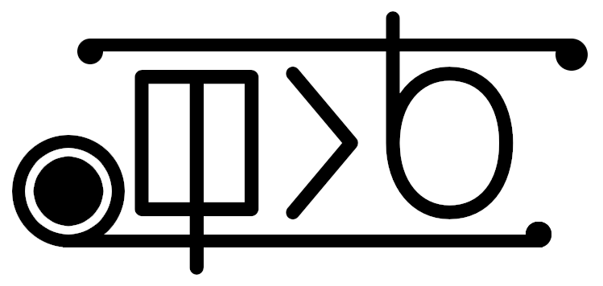

lukin kepeken toki ante: [English](lipu_pi_kama_sona/README-en_US.md "View in English")



# **ilo li sina**

ilo tawa lawa e ilo nanpa kepeken toki "ilo li sina". toki "ilo li sina" li toki pi lawa e ilo nanpa li kepeken e nimi wawa GOTO li lawa e nimi wawa lon nasin pona li kepeken e jan tawa nanpa e nanpa li kepeken taso e poki pi sitelen nimi li tawa ilo nanpa pi wile pi pali ala en awen lon tomo. ;)

"ilo li sina" li toki musi (jan pi toki Inli li kepeken e nimi "esoteric" tawa toki sama ni). ona li tawa ala pali suli. ona li tawa musi.

toki li lili li tawa taso kama jo en toki e nimi. taso, kepeken ni taso la sina ken pali e ijo mute. o lukin e [quadratic.ils](lipu_pana/quadratic.ils "ilo tawa pini e ilo nanpa Quadratic lon toki \"ilo li sina\"") tawa lipu wawa suli lon ona.

ali lon toki ni li nimi. sina ken kepeken e nimi taso.

sina wile kama sona e nasin kepeken pi toki ni la o lukin e [lipu pi nasin kepeken.](lipu_pi_kama_sona/nasin_kepeken-tok.md "lipu pi nasin kepeken pi toki \"ilo li sina\"")

## **nasin pali**

sina wile e ilo CMake en Python lon ilo nanpa sina.

o tawa lon poki lipu "ilo li sina" o toki e nimi wawa ni tawa pali e lipu wawa pini:

```console
$ cmake .
$ make
```

ona li kama lon poki li jo e nimi "ilo_li_sina".

## **lipu wawa pi pana toki**

sina ken alasa e lipu wawa pana lon poki "lipu_pana".

## **pali e ante toki sin**

sina wile pali e ante toki pi toki sin la o pali e lipu pi pini ".lang" lon poki "nimi_en_toki".

nimi pi lipu ni li nimi nanpa toki (sama "en_US.lang" tawa toki Inli pi ma Mewika anu "ru_RU.lang" tawa toki Losi). nimi la o sitelen e nimi toki kepeken sitelen lili (pana la "en") e sitelen '\_' e nimi ma pi toki ni kepeken sitelen suli (pana la "US"). toki li jo ala e ma (sama toki pona, "tok") la o sitelen e nimi toki taso.

o pana e nimi tan ante toki ante (lipu "tok.lang" li pona pona) lon lipu ni. nimi pi ante toki li tu kepeken sitelen '='. o ante ala e nimi pi nanpa 1. ona li tawa nimi wawa. o ante e nimi pi nanpa 2 lon monsi pi sitelen '=' lon toki sina. o pali e wile PR pi wan e ante.

ilo ni li kepeken e poki nanpa LANG pi lawa OS tawa kama jo e toki wile. sina ken ante e ona tawa ni: ilo li toki ala lon toki sina la ona li kama toki ona.
