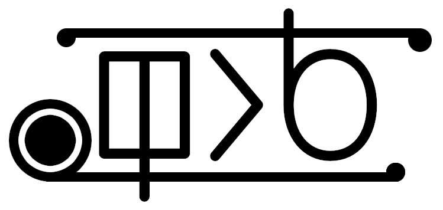

View in a different language: [toki pona](../README.md "lukin kepeken toki pona")



# **ilo li sina**

An interpreter for ilo li sina (meaning "the tool is you"). ilo li sina is an unstructured procedural human-oriented possibly turing-complete string-manipulating programming language for the aspiring homebody computer. ;)

ilo li sina is a small esoteric language, not for solving problems or building applications, but for fun.

ilo li sina is mostly just input and output, and only works with strings; however, you can still build interesting and useful things with it. Look at [quadratic.ils](../lipu_pana/quadratic.ils "Quadratic solver in ilo li sina") to see such a program.

You can find the [documentation here.](nasin_kepeken-en_US.md "ilo li sina documentation")

## **How to build**

You will need CMake and Python installed on your system.

Move into the project directory and run the following commands:

```bash
cmake .
make
```

The final executable will be named "ilo li sina."

## **Adding translations**

You can add translations to the interpreter by adding a .lang file to the folder nimi_en_toki.

The name of the file needs to be the language (lowercase) and region code (uppercase) separated by an underscore (i.e. en_US.lang or ru_RU.lang.) If a language dosen't have a region code then just putting the language code is fine (i.e. tok.lang.)

Copy over one of the prexisting translation files' (preferably tok.lang) data and change the values, the messages on the right, into your langauge. After that, just submit a pull request with your changes.

The interpreter respects the value stored in LANG (enviroment variable.) You can change it to force it to use the language you want.

## **Contributing**

Simply clone this repository, commit your changes to it, and make a pull request stating why your changes should be accepted. Try to keep your code style in line with the current one. If you add a new feature make sure to write about it in the documentation (nasin_kepeken-*.md in the folder lipu_pi_kama_sona.)

The code is documented in Toki Pona, but writing it in English or Russian is also fine. Doesn't matter that much.